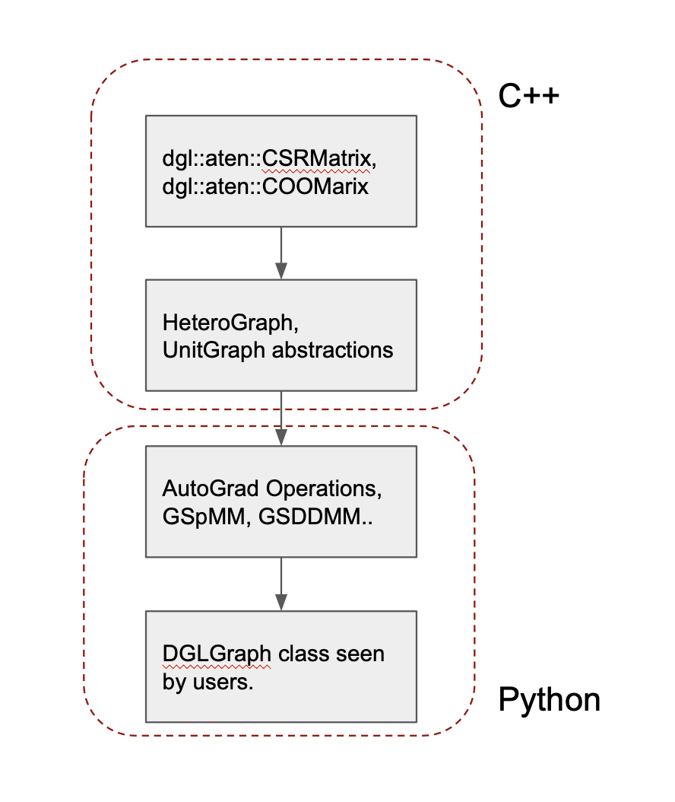
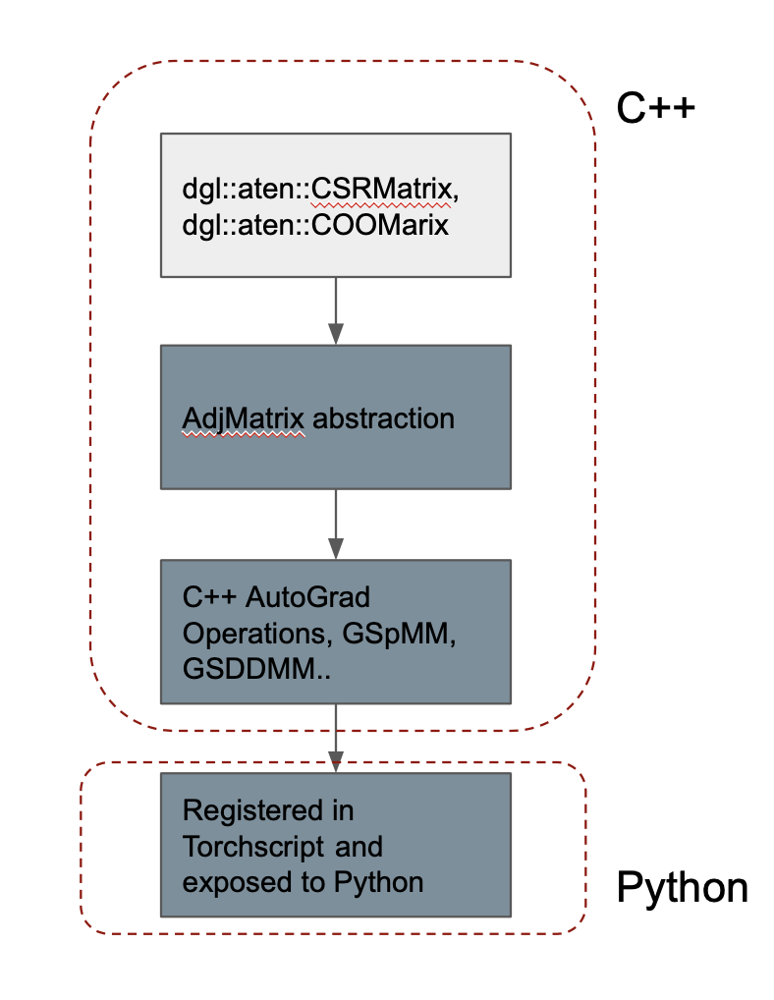

# Torchdgl
The purpose of this prototype repo is two-fold:
 - Exposing DGL's sparse matrix APIs directly to users.
 - Intergrating DGL's sparse matrix ops (with autograd) into TorchScript.

## Motivations
In the lowest level of design, DGL uses `aten::CSRMatrix` and `aten::COOMatrix` to warp all the memory storage, CPU and GPU kernels. Based on them, `UnitGraph` and `HeteroGraph` provide higher level of abstraction to hide the concrete formats of sparse matrix and the conversion among different formats.

In the Python side, DGL implements the forward and backward versions of all the sparse ops using the pybind of `HeteroGraph`, and regisers them into Pytorch as `autograd.Function`. Finially, `DGLGraph` uses these ops to implement the functions used by users, such as `update_all`.

However, the sparse matrix APIs are not directly exposed to the users, and they can not be recognized by TorchScript, which requires the op written in C++.

## New Design
We reuse `aten::CSRMatrix` and `aten::COOMatrix` for low-level storage and kernels, but propose a new abstraction called `AjdMatrix` responsible for managing different formats and conversion. Then we reimplement the autograd of sparse op in C++ and register them into TorchScript.

